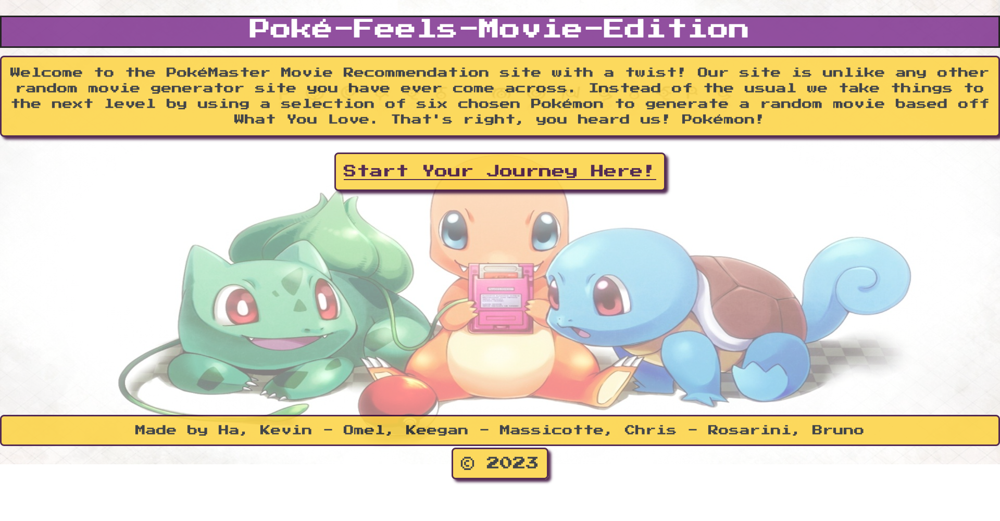

# Poké-Feels-Movie-Edition

##Description

Welcome to the Pokémon Feels Movie Edition Web Application! This interactive web application allows users to choose their favorite Pokémon and receive a randomly selected movie recommendation based on their choices.

##Features

Home Page: The home page displays a warm welcome message and an introduction to the application. It also features a "Click Here" button that directs users to the submission page.

Submission Page: The submission page consists of 6 user input boxes where users can enter their 6 choices of Pokémon. There is also a Pokédex that displays all of the Pokémon available to choose from. Users can easily select their desired Pokémon by clicking on them in the Pokédex. Lastly, there is a "Submit" button that users can click to submit their choices.

Results Page: Once the user submits their Pokémon choices, they are directed to the results page. Here, the user's 6 chosen Pokémon are displayed along with a randomly selected movie recommendation. The movie recommendation is based on the user's Pokémon choices, adding a fun and personalized touch to the web application.

##How To Use

1.Access the home page of the web application.
2.Read the welcome message and introduction.
3.Click the "Click Here" button to go to the submission page.
4.On the submission page, enter your 6 choices of Pokémon in the user input boxes, or click on the Pokémon in the Pokédex to select them.
5.Click the "Submit" button to submit your Pokémon choices.
6.You will be directed to the results page where your 6 Pokémon choices will be displayed, along with a randomly selected movie recommendation based on your choices.

##A Message From The Team!🎯

We hope you enjoy using the Pokémon Feels Movie Edition Web Application and have fun exploring different movie recommendations based on your favorite Pokémon!

##Authors

Keegan Omel,
Chris Massicottec,
Bruno Rosarini,
Kevin Ha,

##Contributors

Austin Grech
Luis Sanchez
Krishna - Assistant Instructor
Shihan Zhang

##Live Link

https://massicottec.github.io/poke-feels-movie-edition/

##GitHub Link

https://github.com/massicottec/poke-feels-movie-edition
